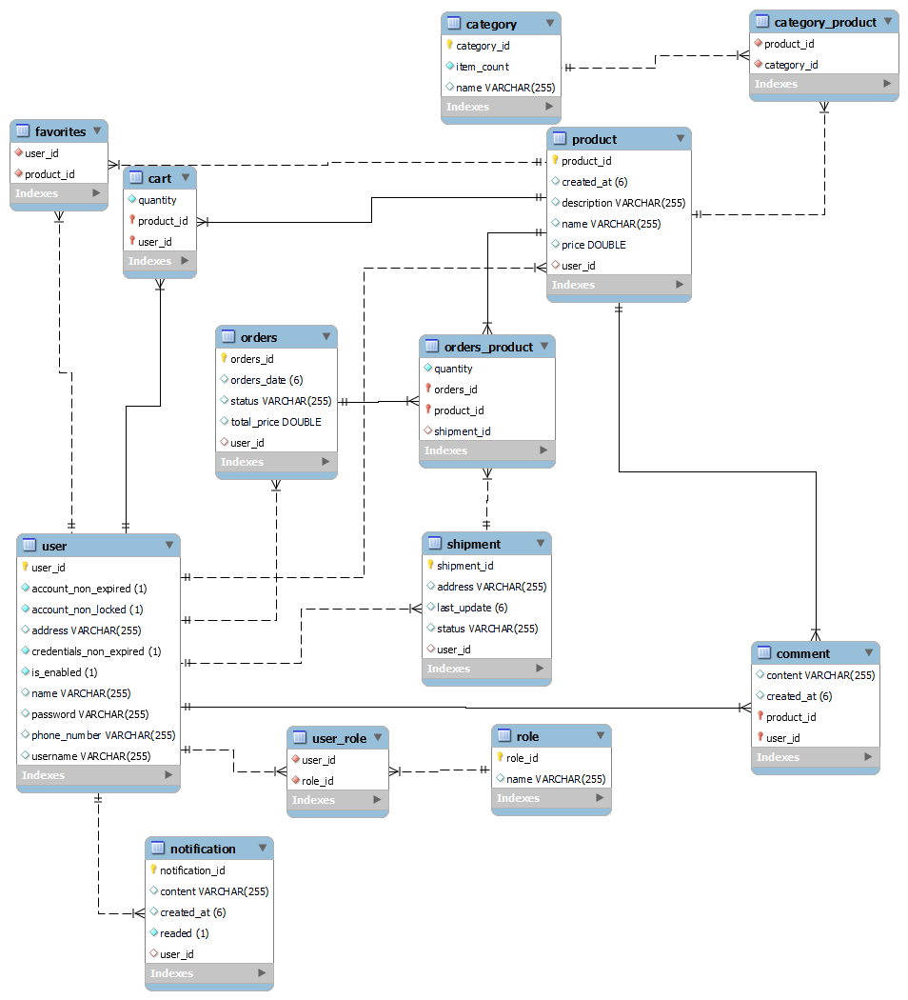

# Spring-boot-Ecommerce-RestApi
This project builds the backend of an e-commerce application using the Spring Boot framework. It exposes many functional endpoints. You will see the details below. The project utilizes a relational database. Here's how to run it step by step:

Clone the project to your own repository.\
Then create a MySQL connection.\
Create a MySQL schema.\
Run the ECOMMERCESQL.sql file with MySQL Workbench.**(This might be redundant. JPA accomplishes the same task.)**\
After that, modify the application.properties file under the spring folders as follows.

```
logging.level.root=warn

server.port=3000
server.servlet.contextPath=/api

jwt.secret=[<Generated random 128 byte base64 code>]
jwt.expire.time=600000

springdoc.api-docs.path=/docs
springdoc.swagger-ui.path=/docs.html

spring.jpa.hibernate.ddl-auto=update
spring.main.allow-circular-references=true
spring.datasource.url=jdbc:mysql://localhost:3306/[<Your Schema name>]
spring.datasource.username=[<Your Connection username>]
spring.datasource.password=[<Your Connection password>]
```


After that your project is ready to run. You can run it using the SchoolprojectApplication.java file.




**Documentation**;

After running the project, you can access the project documentation at http://localhost:3000/api/docs.html. It has been created using OpenAPI.

You can import Postman collection from file named "Spring-ecommerce.postman_collection.json"